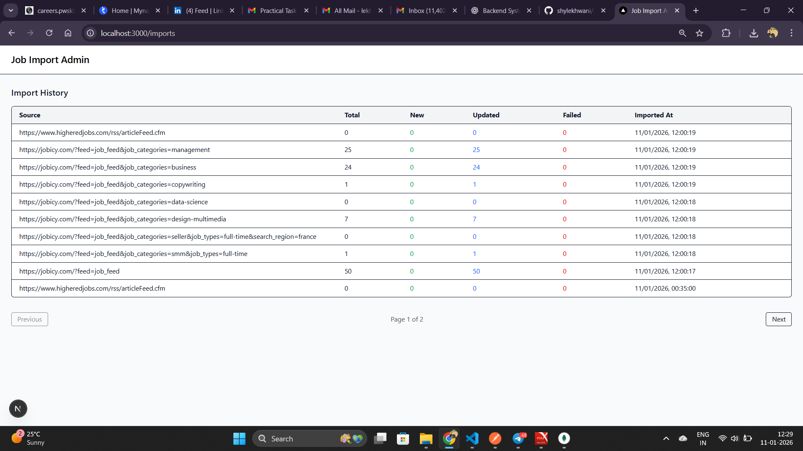

# Job Import System (MERN Assignment)

## 📌 Overview

This project is a **Job Import & Monitoring System** built as part of a technical assignment. The system periodically fetches jobs from multiple external feeds, processes them asynchronously using a queue-based architecture, stores them in MongoDB, and provides an **admin dashboard** to monitor import history.

The focus of this project is **scalability, reliability, and clean architecture**, not just CRUD operations.

---

## 🏗️ Architecture Overview

**High-level flow:**

External Job Feeds → Feed Fetcher → Redis Queue → Worker → MongoDB → Admin UI

### Why this architecture?

- External feeds are unreliable and slow
- Queue-based processing prevents API timeouts
- Workers allow concurrent & retryable processing
- MongoDB upserts ensure idempotency (no duplicates)

---

## 🧰 Tech Stack

### Backend

- Node.js
- Express.js
- MongoDB (Mongoose)
- Redis
- BullMQ (job queue)
- node-cron (scheduled imports)

### Frontend

- Next.js (App Router)
- JavaScript (no TypeScript)
- Tailwind CSS

---

## ⚙️ Backend Features

### 1. Job Feed Ingestion

- Fetches jobs from multiple external XML feeds
- Parses and normalizes job data
- Handles malformed or empty feeds gracefully

### 2. Queue-Based Processing

- Jobs are added to a Redis queue (BullMQ)
- Background workers process jobs concurrently
- Retry & backoff strategy for failures

### 3. Idempotent Job Storage

- MongoDB upsert using unique keys
- Prevents duplicate job entries
- Safe to re-run imports

### 4. Import History Tracking

Each import run stores:

- Source file (feed URL)
- Total jobs fetched
- New jobs
- Updated jobs
- Failed jobs
- Import timestamp

### 5. Cron Job

- Hourly scheduled import using `node-cron`
- Fully automated background operation

### 6. Graceful Shutdown

- Workers close safely on server stop
- Redis connection closed cleanly
- Prevents partial processing

---

## 🌐 Backend APIs

### Get Import History (Paginated)

```
GET /api/imports?page=1&limit=10
```

**Response:**

```json
{
  "data": [ ... ],
  "pagination": {
    "page": 1,
    "limit": 10,
    "total": 42,
    "totalPages": 5
  }
}
```

> This is a read-only admin API used by the frontend dashboard.

---

## 🖥️ Frontend Features

### Admin Dashboard

- Built with Next.js + Tailwind CSS
- Clean, minimal admin-focused UI

### Import History Page

- Displays all import runs in a table
- Columns:
  - Source File
  - Total Fetched
  - New Jobs
  - Updated Jobs
  - Failed Jobs
  - Imported At

### Pagination

- Server-side pagination
- Next / Previous navigation
- Sorted by latest imports

---

---

## ▶️ Running the Project

### Prerequisites

- Node.js
- MongoDB
- Redis

### Backend Setup

```bash
cd server
npm install
npm run dev
```

### Frontend Setup

```bash
cd client
npm install
npm run dev
```

Frontend runs at:

```
http://localhost:3000
```

Backend runs at:

```
http://localhost:5000
```

---

## 🧪 Screenshots

### Import History Dashboard

> Add screenshots here before submission

Example:



---

---

## 🧠 Key Design Decisions

- Used background workers to avoid blocking APIs
- Chose idempotent upserts to ensure data consistency
- Separated controller & service layers for maintainability
- Focused UI on clarity rather than visual complexity

---

## 📈 What This Project Demonstrates

- Real-world backend system design
- Queue-based async processing
- Scalable architecture thinking
- Clean frontend–backend integration

---

## 👤 Author

**Yash Lekhwani ( MERN Developer (Frontend-focused) )**  
Experience: ~2.4 years  
Backend Exposure: ~1 year

---

## ✅ Assignment Status

✔ Backend implementation complete  
✔ Frontend admin dashboard complete  
✔ Pagination & import tracking implemented

**Ready for submission.**
